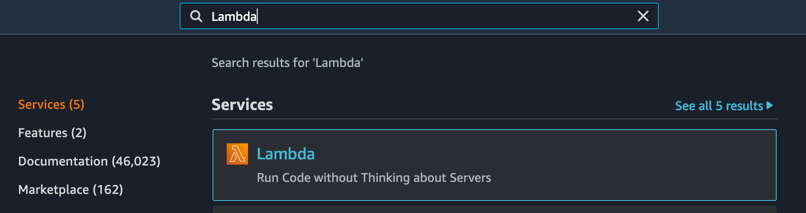

# habitr

Habit-tracking social network built with AWS Amplify Flutter.

- [habitr](#habitr)
- [Features](#features)
- [Getting Started](#getting-started)
  - [Amplify](#amplify)
  - [Lambdas](#lambdas)
  - [Cognito Trigger](#cognito-trigger)
  - [Flutter](#flutter)
  - [Run the App](#run-the-app)
- [Making Changes](#making-changes)
  - [GraphQL Schema](#graphql-schema)
- [Troubleshooting](#troubleshooting)
  - [Logging (CloudWatch)](#logging-cloudwatch)
    - [API (GraphQL)](#api-graphql)
    - [API (REST)](#api-rest)
    - [Functions](#functions)

# Features
- Username/password, Login with Amazon sign-in with Cognito
- Bucket storage with S3
- [GraphQL API](amplify/backend/api/habitr/schema.graphql) with AppSync
- REST API with [Go Lambda functions](amplify/backend/function/)
- Custom AppSync [resolvers](amplify/backend/api/habitr/resolvers) and [pipeline functions](amplify/backend/api/habitr/pipelineFunctions)
- [Dart Lambda functions](lambdas/)
- Analytics with Pinpoint

# Getting Started

Follow these instructions to create the cloud resources needed to run the app in your local environment. Some responses to CLI prompts are marked "\<default\>", in which cases the name does not matter. In other cases, a name is given (like `habitr` for the GraphQL API), in which case it's important to copy it verbatim.

## Amplify

0. Before starting

Create a `backend-config.json` file in `amplify/backend` with an empty JSON object:

```json
{}
```

1. Create a *Login with Amazon* app

Follow the instructions in the **Setup Your Auth Provider** section [here](https://docs.amplify.aws/lib/auth/social_signin_web_ui/q/platform/flutter#setup-your-auth-provider) to setup an Amazon Developer account and create a Login with Amazon app. 

Note down the Client ID and Client Secret.

2. Configure the project

After [configuring](https://docs.amplify.aws/cli/start/install) the Amplify CLI, run `amplify init` from the root of the project.

```sh
$ amplify init

Note: It is recommended to run this command from the root of your app directory
? Enter a name for the environment dev
? Choose your default editor: Visual Studio Code
Using default provider  awscloudformation
? Select the authentication method you want to use: AWS profile

For more information on AWS Profiles, see:
https://docs.aws.amazon.com/cli/latest/userguide/cli-configure-profiles.html

? Please choose the profile you want to use <AWS_PROFILE>
Adding backend environment dev to AWS Amplify Console app: <APP_ID>
```

3. Configure Auth category

Next, run `amplify add auth` and respond to the following prompts:

```sh
$ amplify add auth

Using service: Cognito, provided by: awscloudformation
 
 The current configured provider is Amazon Cognito. 
 
 Do you want to use the default authentication and security configuration? Default configuration with Social Provider (Federation)
 Warning: you will not be able to edit these selections. 
 How do you want users to be able to sign in? Username
 Do you want to configure advanced settings? No, I am done.
 What domain name prefix do you want to use? <default>
 Enter your redirect signin URI: habitr://
? Do you want to add another redirect signin URI No
 Enter your redirect signout URI: habitr://
? Do you want to add another redirect signout URI No
 Select the social providers you want to configure for your user pool: 
 ◯ Facebook
 ◯ Google
❯◉ Login With Amazon
```

The CLI will ask you for the Client ID and Client Secret from the first step.

```sh
Enter your Amazon App ID for your OAuth flow: <CLIENT_ID>
Enter your Amazon App Secret for your OAuth flow: <CLIENT_SECRET>

Successfully added auth resource <default> locally
```

4. Configure GraphQL API

Next, run `amplify add api` and respond to the following prompts:

```sh
$ amplify add api

? Please select from one of the below mentioned services: GraphQL
? Provide API name: habitr
? Choose the default authorization type for the API Amazon Cognito User Pool
Use a Cognito user pool configured as a part of this project.
? Do you want to configure advanced settings for the GraphQL API Yes, I want to make some additional changes.
? Configure additional auth types? Yes
? Choose the additional authorization types you want to configure for the API API key
API key configuration
? Enter a description for the API key: Admin API Key
? After how many days from now the API key should expire (1-365): 365
? Enable conflict detection? Yes
? Select the default resolution strategy Auto Merge
? Do you have an annotated GraphQL schema? Yes
? Provide your schema file path: amplify/backend/api/habitr/schema.graphql

GraphQL schema compiled successfully.
```

5. Replace `CustomResources.json`

Replace `amplify/backend/api/habitr/CustomResources.json` with the contents of [this file](setup/CustomResources.json).

6. Configure `habitrCreateUser` Function

Run `amplify add function` and respond to the following prompts:

```sh
$ amplify add function

? Select which capability you want to add: Lambda function (serverless function)
? Provide an AWS Lambda function name: habitrCreateUser
? Choose the runtime that you want to use: Go
Only one template found - using Hello World by default.

Available advanced settings:
- Resource access permissions
- Scheduled recurring invocation
- Lambda layers configuration

? Do you want to configure advanced settings? No
```

> Note: My CLI kind of bugs out here - make sure to press "n\<RETURN\>" a couple of times, until you get back to your shell.

```sh
? overwrite /Users/nydillon/dev/habitr/amplify/backend/function/habitrCreateUser/src/event.json No
? Do you want to edit the local lambda function now? No
? overwrite /Users/nydillon/dev/habitr/amplify/backend/function/habitrCreateUser/src/go.mod No
? overwrite /Users/nydillon/dev/habitr/amplify/backend/function/habitrCreateUser/src/go.mod No
? overwrite /Users/nydillon/dev/habitr/amplify/backend/function/habitrCreateUser/src/main.go No

Successfully added resource habitrCreateUser locally.
```

7. Configure `habitrUserExists` Function

Run `amplify add function` and respond to the following prompts:

```sh
$ amplify add function

? Select which capability you want to add: Lambda function (serverless function)
? Provide an AWS Lambda function name: habitrUserExists
? Choose the runtime that you want to use: Go
Only one template found - using Hello World by default.

Available advanced settings:
- Resource access permissions
- Scheduled recurring invocation
- Lambda layers configuration

? Do you want to configure advanced settings? No
```

> Note: My CLI kind of bugs out here - make sure to press "n\<RETURN\>" a couple of times, until you get back to your shell.

```sh
? overwrite /Users/nydillon/dev/habitr/amplify/backend/function/habitrUserExists/src/event.json No
? Do you want to edit the local lambda function now? No
? overwrite /Users/nydillon/dev/habitr/amplify/backend/function/habitrUserExists/src/go.mod No
? overwrite /Users/nydillon/dev/habitr/amplify/backend/function/habitrUserExists/src/go.mod No
? overwrite /Users/nydillon/dev/habitr/amplify/backend/function/habitrUserExists/src/main.go No

Successfully added resource habitrUserExists locally.
```

8. Configure `habitrUserIdentity` Function

Run `amplify add function` again and respond to the following prompts:

```sh
$ amplify add function

? Select which capability you want to add: Lambda function (serverless function)
? Provide an AWS Lambda function name: habitrUserIdentity
? Choose the runtime that you want to use: Go
Only one template found - using Hello World by default.

Available advanced settings:
- Resource access permissions
- Scheduled recurring invocation
- Lambda layers configuration

? Do you want to configure advanced settings? No
? overwrite /Users/nydillon/dev/habitr_new/amplify/backend/function/habitrUserIdentity/src/event.json No
? Do you want to edit the local lambda function now? No
? overwrite /Users/nydillon/dev/habitr_new/amplify/backend/function/habitrUserIdentity/src/go.mod No
? overwrite /Users/nydillon/dev/habitr_new/amplify/backend/function/habitrUserIdentity/src/go.mod No
? overwrite /Users/nydillon/dev/habitr_new/amplify/backend/function/habitrUserIdentity/src/main.go No

Successfully added resource habitrUserIdentity locally.
```

9. Configure REST API

Run `amplify add api` and choose `REST` this time. We will configure two paths to connect to the functions made in the previous step:

- `/user/exists` -> `habitrUserExists`
- `/user/identity` -> `habitrUserIdentity`

```sh
$ amplify add api

? Please select from one of the below mentioned services: REST
? Provide a friendly name for your resource to be used as a label for this category in the project: habitrAPI
? Provide a path (e.g., /book/{isbn}): /user/exists
? Choose a Lambda source Use a Lambda function already added in the current Amplify project
? Choose the Lambda function to invoke by this path habitrUserExists
? Restrict API access No
? Do you want to add another path? Yes
? Provide a path (e.g., /book/{isbn}): /user/identity
? Choose a Lambda source Use a Lambda function already added in the current Amplify project
? Choose the Lambda function to invoke by this path habitrUserIdentity
? Restrict API access Yes
? Who should have access? Authenticated users only
? What kind of access do you want for Authenticated users? read
? Do you want to add another path? No

Successfully added resource habitrAPI locally
```

10. Configure Analytics

Run `amplify add analytics` and respond to the following prompts:

```sh
$ amplify add analytics

? Select an Analytics provider Amazon Pinpoint
? Provide your pinpoint resource name: <default>
Auth configuration is required to allow unauthenticated users, but it is not configured properly.
Adding analytics would add the Auth category to the project if not already added.
? Apps need authorization to send analytics events. Do you want to allow guests and unauthenticated users to send analytics events? (we recommend you allow this when getting s
tarted) Yes

Successfully updated auth resource locally.
Successfully added resource <default> locally
```

11. Configure Storage

Run `amplify add storage` and respond to the following prompts:

```sh
$ amplify add storage

? Please select from one of the below mentioned services: Content (Images, audio, video, etc.)
? Please provide a friendly name for your resource that will be used to label this category in the project: <default>
? Please provide bucket name: <default>
? Who should have access: Auth users only
? What kind of access do you want for Authenticated users? create/update, read, delete
? Do you want to add a Lambda Trigger for your S3 Bucket? No

Successfully added resource <default> locally
```

12. Check the status

At this point, you can run `amplify status` at this point to see all the resources which will be created.

```sh
$ amplify status

Current Environment: dev

| Category  | Resource name      | Operation | Provider plugin   |
| --------- | ------------------ | --------- | ----------------- |
| Auth      | <default>          | Create    | awscloudformation |
| Api       | habitr             | Create    | awscloudformation |
| Api       | habitrAPI          | Create    | awscloudformation |
| Storage   | <default>          | Create    | awscloudformation |
| Analytics | <default>          | Create    | awscloudformation |
| Function  | habitrCreateUser   | Create    | awscloudformation |
| Function  | habitrUserExists   | Create    | awscloudformation |
| Function  | habitrUserIdentity | Create    | awscloudformation |

```

13. Deploy to the cloud

When you're ready, run `amplify push` to deploy the application to AWS (this will take about 20-30 minutes).

```sh
$ amplify push

✔ Successfully pulled backend environment dev from the cloud.

Current Environment: dev

| Category  | Resource name      | Operation | Provider plugin   |
| --------- | ------------------ | --------- | ----------------- |
| Auth      | <default>          | Create    | awscloudformation |
| Api       | habitr             | Create    | awscloudformation |
| Api       | habitrAPI          | Create    | awscloudformation |
| Storage   | <default>          | Create    | awscloudformation |
| Analytics | <default>          | Create    | awscloudformation |
| Function  | habitrCreateUser   | Create    | awscloudformation |
| Function  | habitrUserExists   | Create    | awscloudformation |
| Function  | habitrUserIdentity | Create    | awscloudformation |

? Are you sure you want to continue? Yes
```

14. Configure environment variables

The output of `amplify push` will be several URLs and API keys. It will be important to note these for yourself, but keep them private and outside of version control.

While working with scripts and tooling, it can be helpful to store these values as environment variables. The following steps will involve configuring Lambdas with the GraphQL endpoint and GraphQL API key from the previous step.

## Lambdas

The `habitrCreateUser` and `habitrUserExists` lambdas, which was deployed as Amplify Functions, need access to this GraphQL API key and endpoint through environment variables.

Log in to the AWS Console and navigate to **Lambda**.



Search for `habitrCreateUser-dev` and select it. Under the **Configuration** tab, click `Environment variables`, then **Edit**. Add `GRAPHQL_API_ENDPOINT` and `GRAPHQL_API_KEY`, corresponding to the values from `amplify push`.

Perform the same steps for `habitrUserExists-dev`.

## Cognito Trigger

The final step is to configure our `habitrCreateUser` Lambda to respond to Cognito events.

Navigate to **Cognito** in the AWS Console. Click on **Manage User Pools**.


Find the User Pool associated with your Habitr project, and on the left side click `Triggers`.

The trigger event we're interested in is `Post confirmation`. Find your Lambda in the dropdown and remember to click **Save changes** when you're done.

## Flutter

Run the following commands from the root of the project:

1. `flutter pub get`
2. `make models`

## Run the App

If everything went well in the previous steps, you should now be able to run the Habitr project! 🎉

To create some dummy habit data, you can use the `seed_habits.dart` program under the `scripts` folder. First, run the app and sign up for a user account, then run the script like so:

```sh
$ dart scripts/seed_habits.dart \
> --user=<USERNAME> \
> --endpoint=<GRAPHQL_API_ENDPOINT> \
> --api-key=<GRAPHQL_API_KEY>
```

# Making Changes

## GraphQL Schema

Making changes to the GraphQL schema is a three-step process. First, edit the [schema file](amplify/backend/api/habitr/schema.graphql). Then, run `amplify push` to deploy changes. Finally, run `make schema` from the root of the project to regenerate the model files.

> Note: Make sure to have `GRAPHQL_API_ENDPOINT` and `GRAPHQL_API_KEY` environment variables exported in your shell before running `make schema`.

# Troubleshooting

Amplify is primarily a wrapper around AWS and an orchestrator of many AWS resources. Each category spans multiple components of AWS, so troubleshooting can quickly mean understanding the underlying AWS services. In general, the following mapping will give you a starting point for understanding the relationships between Amplify categories and their raw underpinnings.

- All Categories
    - IAM
    - CloudWatch
- Auth (Cognito)
    - Cognito User Pools
    - Cognito Identity Pools
    - SES
- API (GraphQL)
    - AppSync
    - DynamoDB
- API (REST)
    - API Gateway
    - Lambda
- Analytics (Pinpoint)
    - Pinpoint
- Storage (S3)
    - S3

## Logging (CloudWatch)

One of the best tools for troubleshooting your stack is CloudWatch. Logging is enabled by default for many resources. For others, it requires a bit of manual setup and can incur some additional charges.

### API (GraphQL)

> Logs **are not** enabled by default.

If you go to **AppSync** in the AWS Console, you'll see the GraphQL API you created during setup. Click on that, then navigate to `Settings`. Scroll to `Logging` and click **Enable Logs** to have logs start streaming to CloudWatch.

For debugging custom resolvers, it is helpful to enable `Include verbose content` and set the `Field resolver log level` to **All**. This will log all steps performed in generating mapping templates and important debug information.

Remember to click **Save** when you're done.

### API (REST)

> Logs **are not** enabled by default.

Navigate to **IAM** in the AWS Console and select `Roles`. Click on **Create role**. Under `Choose a use case`, pick **API Gateway**. Click **Next**, then **Next**.

For the `Role name`, choose something descriptive like `habitr-api-gateway-logging` and click **Create role**. Find the new role in the list and click it's name. Copy the `Role ARN`.

Navigate to **API Gateway** in the AWS Console. Select your REST API, then click the global `Settings` link on the left-hand side. Paste the Role ARN from before and click **Save**.

On the left-hand side, under your API name, click `Stages` then select `dev` in the list. Click the `Logs/Tracing` tab and check **Enable CloudWatch Logs**. Change the Log level to your preference, and select `Log full requests/response data` if you'd like to see the full input and output to your functions. Click **Save Changes**.

### Functions

> Logs **are** enabled by default.

Navigate to **CloudWatch** in the AWS Console to see logs for your Lambdas/Functions.